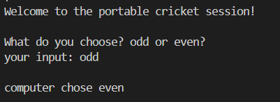
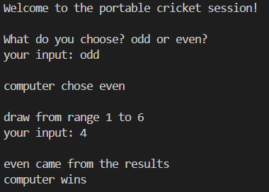
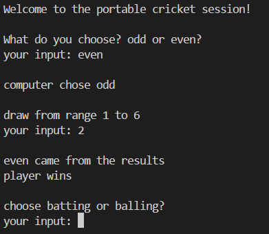
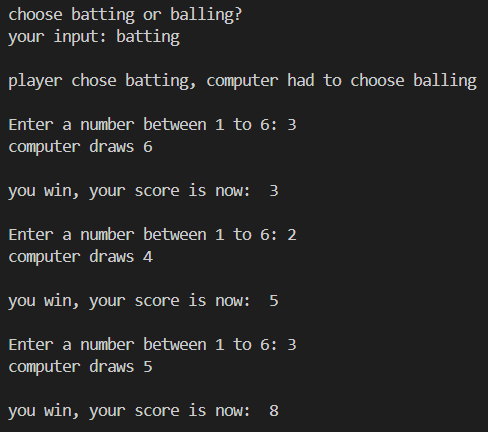
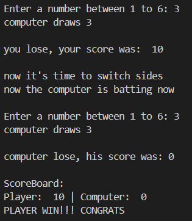

# How to play

when you load the game, you will be asked about a toss which starts with you choosing odd or even 
then the computer will choose the opposite of what you chose.  

**Example-**: you choose odd. now the computer will chose even 
then you both chose a number between 1 to 6, then draw it 
if the player's and computer's number sum up to be odd or even  
whoever chose odd or even will win  

  and now have the ability to chose batting or balling
batting is where you make the score 
balling is where you take the batter out by having both of draws to be the same 
then you switch sides and do the same until the other player beats the target score and they win

